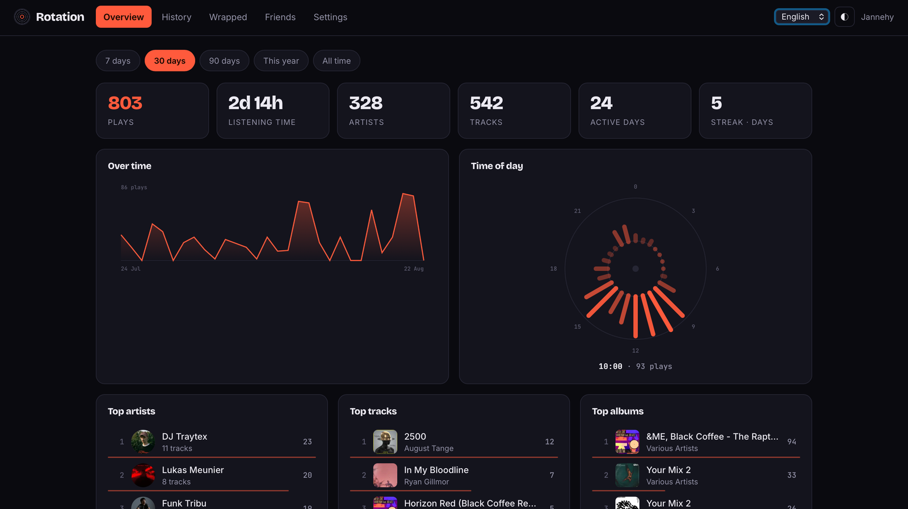
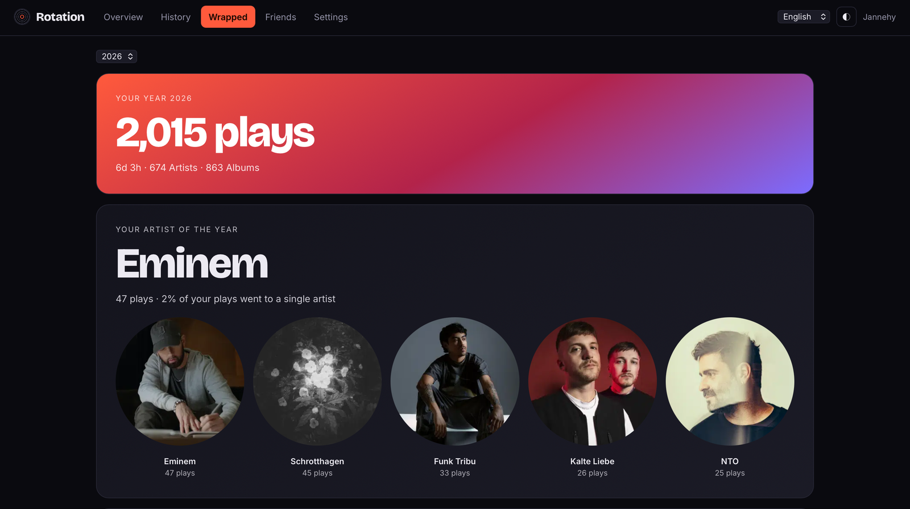

# Rotation

Listening statistics for [Navidrome](https://www.navidrome.org) — self-hosted,
on your own server, next to the library they describe.

Navidrome already counts every play. Rotation is the part that reads those
numbers back to you: top artists, tracks, albums and genres over any period, a
yearly recap you play through like a story, and top-track playlists that write
themselves back into your library.

<p align="center">
  
</p>

## What it does

| | |
|---|---|
| **Top lists** | Artists, tracks, albums and genres for 7, 30 or 90 days, this year or all time — each with rank, plays and hours |
| **Detail pages** | Every artist, album and track with its own history, its rank in the period, and a 30-second preview from your library |
| **History** | A timeline, a clock of your day, and a weekday-by-hour heatmap, bucketed in your own time zone |
| **Recap** | Your year as a full-screen story: it runs by itself, holds when you hold it, plays music from your library and asks you to guess before it tells |
| **Playlists** | Any top list as a real Navidrome playlist — 25, 50 or 100 tracks — refreshed daily and marked as maintained |
| **Friends** | Other users of the same Navidrome: what they have on rotation, and the artists you have in common |
| **Looks** | Six accent colours, light and dark, English and German |

<p align="center">
  
</p>

Native apps: [iOS](https://github.com/Jannehy/rotation-ios) ·
[Android](https://github.com/Jannehy/rotation-android). Both speak the same API
as the browser — nothing to enable on the server.

## How it fits together

Rotation reads Navidrome's SQLite database **read-only** (`mode=ro`, plus
`PRAGMA query_only`) — that is where the play counts live and there is no API
for them. Everything else goes through Navidrome's official Subsonic API as
your own user: sign-in is verified there, artwork and audio are proxied from
there, and playlists are created there.

It never writes to Navidrome's database. Its own database holds only what
Navidrome does not know about: friendships, settings and playlist rules.

## Docker

```yaml
services:
  rotation:
    image: ghcr.io/jannehy/rotation:latest
    container_name: rotation
    ports:
      - "8770:8770"
    volumes:
      # Navidrome's data directory, read-only. Mount the directory, not just
      # the .db file — SQLite needs the -wal and -shm files next to it.
      - /path/to/navidrome:/navidrome:ro
      - ./data:/data
    environment:
      - NAVIDROME_URL=http://navidrome:4533
      - TZ=Europe/Berlin
    restart: unless-stopped
```

```bash
docker compose up -d
```

Open `http://your-server:8770` and sign in with any Navidrome account. There is
no separate user database and no setup wizard — Navidrome decides who gets in.

## Bare metal

```bash
pip install -r requirements.txt
NAVIDROME_DB=/var/lib/navidrome/navidrome.db \
NAVIDROME_URL=http://127.0.0.1:4533 \
ROTATION_DATA=./data \
TZ=Europe/Berlin \
python -m rotation
```

`python -m rotation` is the development server. For production use the WSGI
server that is already in `requirements.txt`:

```bash
gunicorn --bind 0.0.0.0:8770 --workers 1 --threads 8 "rotation.app:create_app()"
```

One worker with threads, on purpose: every request is a short read against
SQLite, and the Subsonic tokens live in that process's memory — never on disk.

### Environment

| Variable | Default | What it is |
|---|---|---|
| `NAVIDROME_DB` | `/navidrome/navidrome.db` | Navidrome's database, read-only |
| `NAVIDROME_URL` | `http://navidrome:4533` | how Rotation reaches Navidrome |
| `ROTATION_DATA` | `/data` | Rotation's own database and session key |
| `TZ` / `ROTATION_TZ` | `UTC` | the zone days and hours are bucketed in |
| `ROTATION_PORT` | `8770` | port for the built-in server |
| `ROTATION_SECRET_KEY` | generated | session key; generated into `ROTATION_DATA` if unset |
| `ROTATION_VERIFY_TLS` | `true` | set to `false` for a self-signed Navidrome certificate |

## Maintained playlists

A top list can be handed to Navidrome as a playlist. Rotation remembers the rule
— period and language — and rewrites the playlist once a day, so it stays true
without you touching it:

| Period | Tracks |
|---|---|
| 7 days | 25 |
| 30 days | 50 |
| 90 days, year, all time | 100 |

The playlist's comment says so in as many words, so nobody edits it by hand and
wonders where their changes went. Deleting the rule in Rotation deletes the
playlist in Navidrome.

The refresh needs your Navidrome credentials, which Rotation only has while you
are signed in. It keeps them in memory for as long as the process runs and
writes them nowhere — so after a restart, the first sign-in re-arms the daily
refresh.

## Demo mode

`demo/demo.json` is an invented listening year. Sign in with user `demo` and any
password to see the whole app without a server behind it — the same data the
apps use for their demo mode.

```bash
python tools/make_demo.py     # regenerates it, seeded and reproducible
```

## Requirements

- **Navidrome 0.55** or newer, with its data directory readable
- **Python 3.11** or newer (the image is on 3.12)
- Nothing else: three dependencies, no database server, no build step for the
  frontend

## Licence

[MIT](LICENSE)
